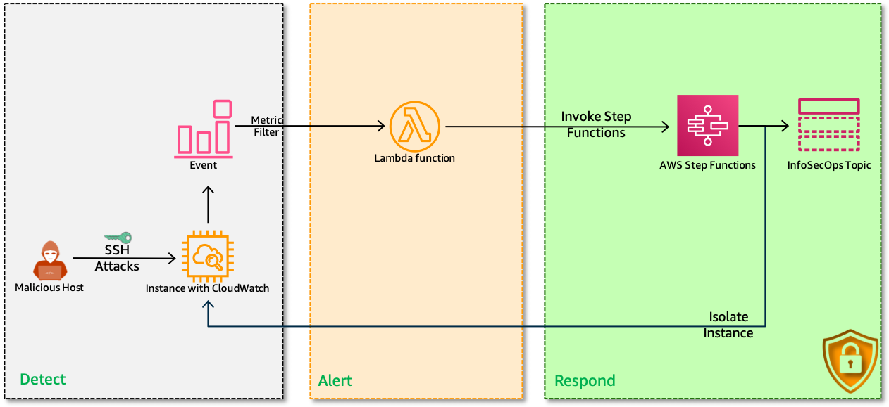
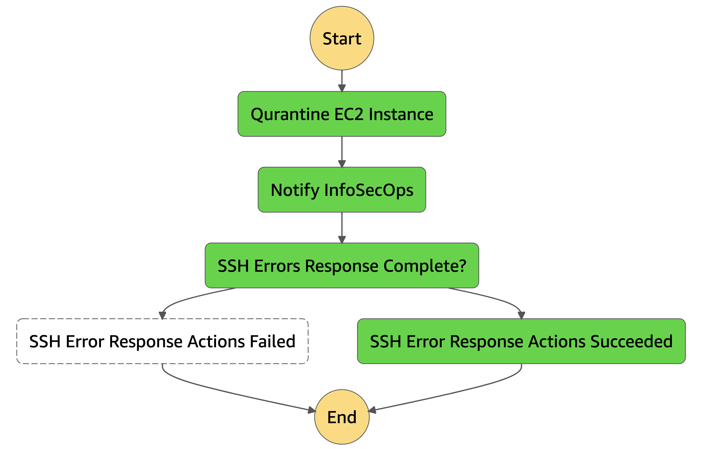

# 👮Security Automation: Monitor & Defend your servers against SSH Intrusion Attempts

- Do you monitor `invalid ssh user` login attempts?
- Do you monitor `invalid ssh key` login attempts?
- Do you monitor multiple `ssh disconnects` in a short period of time?

That is exactly what we are going to do right now using, `AWS CloudWatch`, `AWS EC2`, `AWS StepFunctions` & `SNS`

  

  Follow this article in **[Youtube](https://www.youtube.com/c/ValaxyTechnologies)**


1. ## Prerequisites

    This demo, instructions, scripts and cloudformation template is designed to be run in `us-east-1`. With few modifications you can try it out in other regions as well(_Not covered here_).

    - AWS CLI pre-configured - [Get help here](https://youtu.be/TPyyfmQte0U)
    - **Optional** AWS CDK Installed & Configured - [Get help here](https://www.youtube.com/watch?v=MKwxpszw0Rc)

1. ## Solution Overview

    In this repo, I have included a cloudformation template that provisions the resources to setup a fully automatic remedation engine.

    - **EC2 Instance**: We will use this instance to attack
        - This instance will be pre-baked with cloudwatch agent to send `ssh` logs to Cloudwatch LogGroups
    - **CloudWatch LogGroup**: Stores the `ssh` logs from EC2
        - A Lambda function will be subscribed to this log group
    - **Lambda**: Triggers the step function to isolate instance
        - The trigger is based on `ssh_invalid_user` log filter
        - Pass the `inst_id` to the step function
    - **StepFunction**:
        - *EXTREME REMEDIATION ACTION*: Isolate the EC2 instance with quarantine security group
            - As this is a demo, This automation will quarantine the EC2 Instance with SG. You can modify this lambda to suit your needs
        - Notify InfoSecOps
    - **CloudWatch Alarms**
        - Invalid User Alarm
        - Invalid Key Alarm
        - Too Many Disconnects
    - **IAM Roles**: For lambda and step functions with restrictive permissions

    _**Note**: Sample commands to trigger ssh failures to test the solution can be found in the output section of the cloudformation template_

1. ## Deployment

  You have couple of options to set this up in your account, You can use [AWS CDK](https://www.youtube.com/watch?v=MKwxpszw0Rc) or use the cloudformation template generated by CDK. All the necessary steps are baked into the templates, you can launch it and try it out.

  1. ### Method 1: Using AWS CDK

      If you have AWS CDK installed you can close this repository and deploy the stack with,

        ```sh
        # If you DONT have cdk installed
        npm install -g aws-cdk

        git clone https://github.com/miztiik/security-automation-respond-to-failed-ssh-access.git
        cd security-automation-respond-to-failed-ssh-access
        source .env/bin/activate
        pip install -r requirements.txt
        ```

      The very first time you deploy an AWS CDK app into an environment _(account/region)_, you’ll need to install a `bootstrap stack`, Otherwise just go ahead and deploy using `cdk deploy`

        ```sh
        cdk bootstrap
        cdk deploy
        ```

  1. ### Method 2: Using AWS CloudFormation

      Look for the cloudformation template here: `cdk.out` directory, _From the CLI,_

        ```sh
        aws cloudformation deploy \
            --template-file ./cdk.out/security-automation-respond-to-failed-ssh-access.template.json \
            --stack-name "MiztiikAutomationStack" \
            --capabilities CAPABILITY_IAM
        ```

1. ## Testing the solution

    1. Goto EC2>SecurityGroup>Update port22 rule to allow only your IP(by default it allows ssh traffic from within the vpc)
    1. Goto `AWS SNS` subscribe yourself to the `InfoSecOps` SNS Topic.
    1. Use the commands given in the cloudformation template to trigger `invalid_ssh_user` logs,
    1. You should receive an email with remediation action
    1. Check the step functions for execution(The EC2 instance also must have a new SG attached to it)
        You should be able to see something like this for a successful remediation.
    

    Now that we have confirmed the solution is working, you can extend the solution as required.

1. ## Next Steps: Do Try This

    - Qurantine User/Role triggering multiple failures
    - Look at removing SSH/22 access completely

1. ## Additional Comments

    As mentioned earlier, this is a reactive solution. This automation should not be the primary means of defence against weak security controls. You should consider,

    - Who has permissions to change SSH Keys.
    - Are those permissions restricted only the resources they own? - Refer [Attribute Based Access Control - ABAC](https://github.com/miztiik/attribute-based-access-control-ec2)
    - Are you auditing those privileges automatically?
    - If all else fails, do you have mechanisms that will automatically respond to events?

1. ## CleanUp

    If you want to destroy all the resources created by the stack, Execute the below command to delete the stack, or _you can delete the stack from console as well_

    1. Delete Quarantine Security Group
    1. Delete CloudWatch Lambda LogGroups
    1. Delete the stack[s],

    ```bash
    # Delete the CF Stack
    aws cloudformation delete-stack \
        --stack-name "MiztiikAutomationStack" \
        --region "${AWS_REGION}"
    ```

    This is not an exhaustive list, please carry out other necessary steps as maybe applicable to your needs.

## Buy me a coffee

Buy me a coffee ☕ through [Paypal](https://paypal.me/valaxy), _or_ You can reach out to get more details through [here](https://youtube.com/c/valaxytechnologies/about).

### References

1. [Custom metrics from EC2 Linux to CloudWatch](https://aws.amazon.com/premiumsupport/knowledge-center/cloudwatch-custom-metrics/)
1. [Monitor and Visualize Failed SSH Access Attempts](https://aws.amazon.com/blogs/security/how-to-monitor-and-visualize-failed-ssh-access-attempts-to-amazon-ec2-linux-instances/)

### Metadata

**Level**: 200
